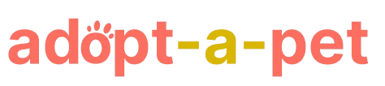

  
  
<i>This project, adopt-a-pet, is a Django-based web application that simplifies the process of adopting pets from shelters. It is developed as     part of our Information Management 2 capstone.</i>

  

 

---

## 📗 Table of Contents

- [Introduction](#introduction)
- [Features](#features)
- [Getting Started](#getting-started)
  - [Prerequisites](#prerequisites)
  - [Setup](#setup)
  - [Install](#install)
  - [Usage](#usage)
  - [Run tests](#run-tests)
  - [Deployment](#deployment)
- [ERD](#erd-entity-relationship-diagram)
- [UI/UX](#uiux-design)
- [Gantt Chart](#gantt-chart)
- [Developers](#developers)
- [Contributors](#contributors)
- [License](#license)

---

## 📖 Introduction

[![Admin Dashboard][product-screenshot]]('static/images/admin-dashboard.png')

adopt-a-pet is a web application designed to make the pet adoption process easier for both animal shelters and adopters. It helps users browse pets, submit adoption requests, schedule pick-ups, and receive notifications, while shelter admins can manage pet listings and oversee the adoption process. This project aims to develop a streamlined and efficient pet adoption system to improve the adoption experience for both shelters and potential adopters.

(<a href="#readme-top">back to top</a>)

---

## Features
1. **User Registration and Authentication:** Users can create accounts and log in securely.
2. **Profile Management:** Users can update personal details and view their adoption history.
3. **Pet Listing:** A detailed listing of all available pets, with information about breed, age, and status.
4. **Adoption Request:** Users can submit requests to adopt pets of their choice.
5. **Pick-Up Scheduling:** Users can schedule a pick-up date for adopted pets.
6. **Notifications:** Receive updates on adoption status, new pet listings, and scheduled visits.

(<a href="#readme-top">back to top</a>)

---

### Built With

(<a href="#readme-top">back to top</a>)

---

## 💻 Getting Started

(<a href="#readme-top">back to top</a>)

---

## Gantt Chart

The timeline for the development of this project is available in the Gantt Chart below:

[Gantt Chart](https://docs.google.com/spreadsheets/d/1xkvWZaWizDLPvSHAJ-dwQYHgKrJD6Z7OzchyzyKRr8s/edit?usp=sharing)

(<a href="#readme-top">back to top</a>)

---
## ERD (Entity Relationship Diagram)

The following ERD outlines the relationships between entities in the system, such as users, pets, and adoption requests:

[ERD Diagram](https://drive.google.com/file/d/1hNGwf2DInYBS6GWfPdmwFCWZkkdSKpuF/view?usp=sharing)

(<a href="#readme-top">back to top</a>)

---

## UI/UX Design

The design and layout of the user interface can be explored via the Figma link below:

[UI/UX Design](https://www.figma.com/design/QkxAZ7so69q8vqw4oeFkwE/Adopt-a-Pet?node-id=0-1&t=AOHbSggJNBGv0g9K-1)

(<a href="#readme-top">back to top</a>)

---

## 👥 Developers
- Abdullah Anamerah M.
- Dutosme Jan Raye Edbert L.
- Gales Chrizza Arnie T.

---
## 🤝 Top Contributors

(<a href="#readme-top">back to top</a>)

---

## 📝 License
This project is open-source and licensed under the MIT License.  See `LICENSE.txt` for more information.

(<a href="#readme-top">back to top</a>)

